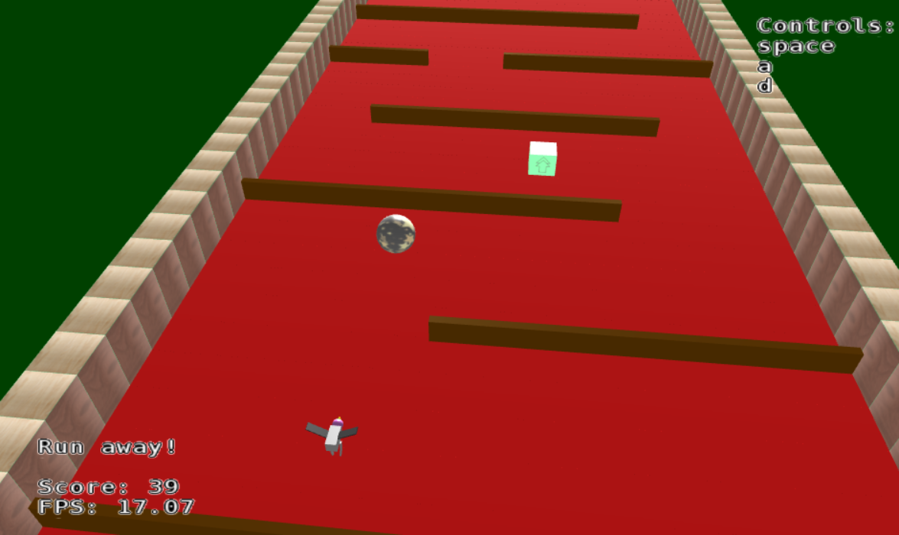

Bird Escape
===========

Roll forward, move sideways to dodge walls, and pick up powerups to escape from the bird!
Every time the bird eats one of the balls, the bird loses some its velocity and is moved back a couple of units.
Once the bird has eaten all of the balls, the game ends.

Powerups:
Pyramid: Creates a copy of the ball.
Cube: Increases forward velocity and horizontal velocity cap for a couple seconds.

Controls:
spacebar: Play/Pause
a: Move left
d: Move right

Hierarchical object: Bird (body + legs = 3-tiered)
Polygonal object: Pyramid and stage sidewalls
Texture mapped objects: Pyramid and stage sidewalls

Most of the game code resides in game.ts, which is compiled into the Javascript in game.js.
